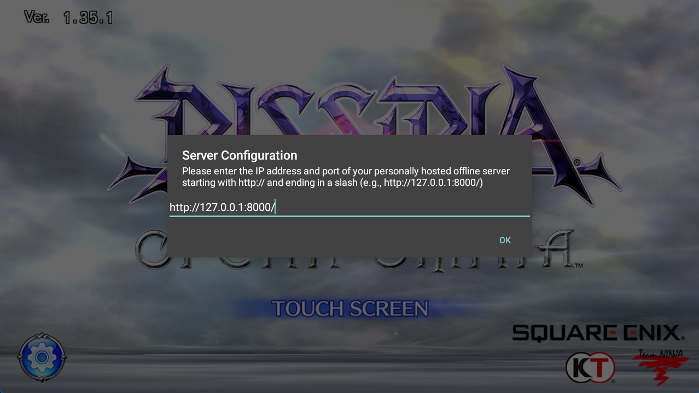
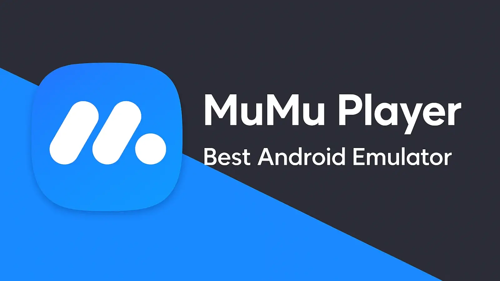
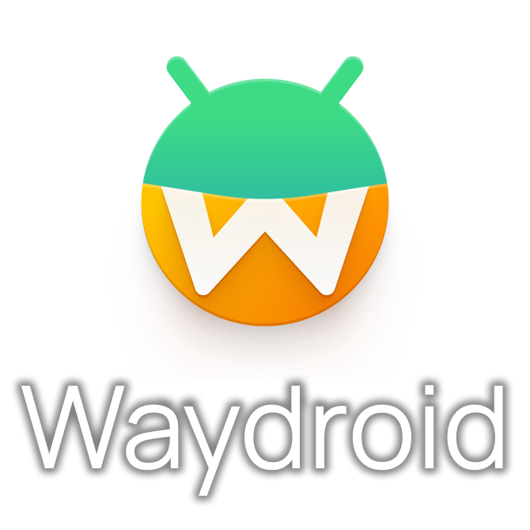
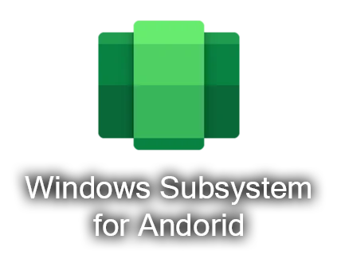
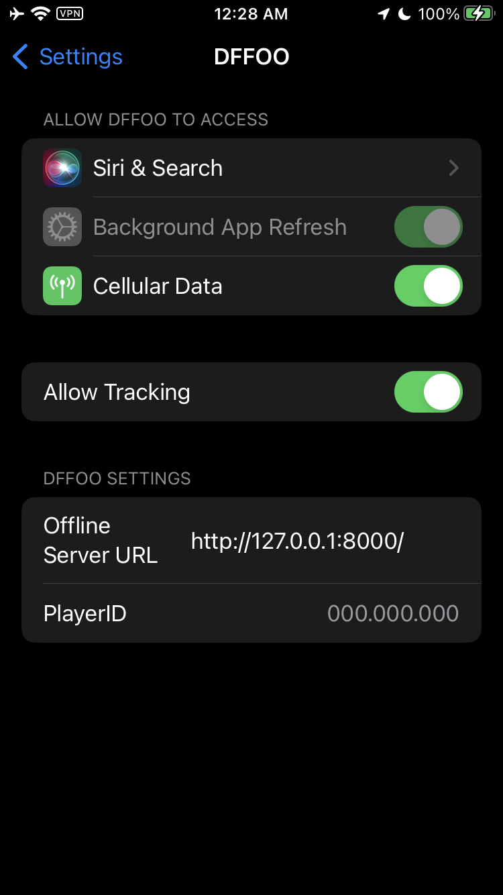
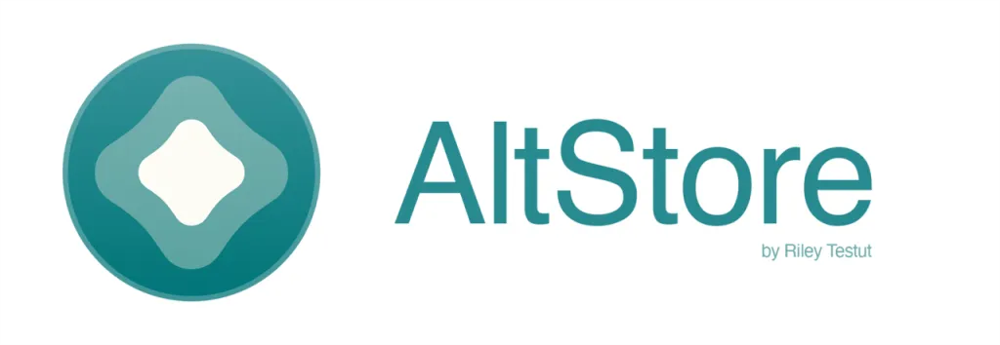
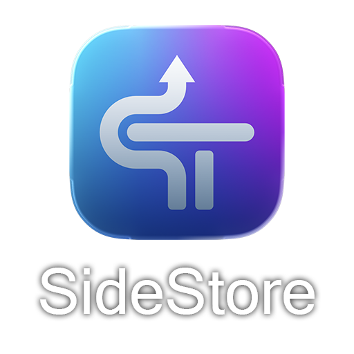

# Dissidia Final Fantasy Opera Omnia Clients

The everything guide to getting your game client running again!

Table of contense:
- [Android Devices](#for-android-devices)
- [Android Emulators](#for-android-emulators)
- [iOS Devices](#for-ios-devices)
  - [Sideload Options](#recommended-sideload-options)
- [Mac Machines](#for-mac-machines)
- [Linux Machines](#for-linux-machines)

# For Android Devices

**Difficulty**: Easy

For getting the game client running again on Android, simply download the apk version of the game you want from the [/clients/Android](./clients/Android) folder. Install it on your device (you may have to make sure the device *allows apps to be installed from unofficial sources*). When you launch the game, it will display a prompt for your offline server address. You'll need to enter in the address displayed on your offline server. It should be formated as displayed with http://[ip address]:[active port]/ (ending in a slash). After entered, it will persist between launches. So after the first entry, anytime you start the game, the same address will be redisplay. Then you'll only have to hit "ok" and continue on.

# For Android Emulators

**Difficulty**: Easy

Any emulators that ran the offical client should be able to run the modded versions. Just follow the direction for [Android Devices](#for-android-devices) after downloading the apk version of the game you want from the [/clients/Android](./clients/Android) folder and you should be fine. Again, making sure the device *allows apps to be installed from unofficial sources*.

## Recommended Android Emulators

### [MuMu Player](https://www.mumuplayer.com/)

**Difficulty**: Easy

[MuMu Player](https://www.mumuplayer.com/) as of v5.0 is ad and bloatware free. On Windows, it works with Hyper-V enabled as well as a bunch of improvements over other emulators I have tried. There are versions for Mac and a beta for Linux as of writing this. This is our recommended emulator for Windows.

### [Waydroid](https://waydro.id/)

**Difficulty**: Easy

If you have a Linux based system, [Waydroid](https://waydro.id/) is the way to go. Being that both the Android client and Linux are Arm64 based, Waydroid is less of an emultor and more of a transition layer. You'll get not only the best performance outside of a Android device, but also the most integrated. This is our recommended emulator for Linux systems.

### [Windows Subsystem for Android](https://github.com/MustardChef/WSABuilds/releases)

**Difficulty**: Medium / Hard

If you're running Windows 11, one of the (formally) best integrated emulator you can get is [Windows Subsystem for Android](https://github.com/MustardChef/WSABuilds/releases). It has the feel of Waydroid for Linux but on Windows. Apps have thir own window and apk files are installed directly to your system as if they were Windows apps. 

Unfortunately Windows has stop support for the system as of 2025 and taken down most methods of installation. But fortunately [MustardChef](https://github.com/MustardChef/WSABuilds) on github has maintained a working build. There are issues and it can break (and has) on any given Windows update. But if a fully integrated system is what you're looking for, this might be worth the headache.

Go to [MustardChef release](https://github.com/MustardChef/WSABuilds/releases) for Windows 11 x64 builds (or ARM64 if you're running Windows installed on a Mac machine). Look for `NoGApps-RemovedAmazon` in the file title for a bare bones, no bloatware set up. Follow the install instructions. Then for the best preformance use these settings:

In `Advanced Settings`: 
- Turn on `Developer mode`. 
- In `Memory and preformance`, set memory allocations to least `6 GB` (recommended `Custom 8192` as 8 GB)
- Set `Graphics preference` to `High preformance`
- Set `Window focus` to `Independent`

In `Experimental features`:
- Turn on `Local network access` 
- Turn on `Share user folders` then set it to where you downloaded the .apk files.

If you have `Share user folders` on, click back to the `System` tab then open `Files`. It should open the Files app to display a `Windows` folder at the bottom. The apk file should be displayed inside. Clicking on it will install the game client. You can verify that it installed by clicking the `Apps` tab in `Windows Subsystem for Android` window and seeing if it's displayed.

As a bonus, if you have `Local network access` active and you're on the same system running the offline server, you can keep the offline server URL to the default `http://127.0.0.1:8000/`. The the client will automatically connect without the need for a machine IP address.

# For iOS Devices

**Difficulty**: Hard

With Opera Omnia for iOS, the method is a little different as Apple has more protections but you do have a few options for sideloading. 

But the easiest way is if you have a jailbroken device. You can simply download the ipa version of the game you want from the [/clients/iOS](./clients/iOS) folder and install it with whatever installer you use. Once installed, go to your Settings app and find the app name. Scroll down and you should see "Offline Server URL" as a field you can edit. You'll need to enter in the address displayed on your offline server. It should be formated as displayed with http://[ip address]:[active port]/ (ending in a slash). After entered, you can run the game as you normally would and you shouldn't have any issues (you will likely get a message asking you for permissions to use local network communications on first launch, you must allow or you'll get 404 errors).

__Note:__ You must have the app installed a __"User"__ app not a __"System"__ app (something a lot of jailbreaks do) or the game won't appear in Settings. Most jailbreaks let you switch the type of install. So you may have to switch it from __System__ to __User__ and then back to __System__ to enter the url.

## Recommended Sideload Options

For non-Jailbroken devices:

### [Sideloadly](https://sideloadly.io/)

**Difficulty**: Medium

Check out [Sideloadly](https://sideloadly.io/) for a non-jailbroken method of installation. You can use this program to not only sideload apps to your non-jailbroken iOS device but also your Mac. It requires a server running on your machine that you sideloaded from to have access to refreshing the install of the app or it will expire after 7 days.

__Note:__ All sideload apps have a 7 day window of operation for free Apple Developer accounts. You will need to re-new the app on the device between those 7 days for it to continue to work. Free developer accounts only allow 3 apps installed at a time (per account __NOT__ device). So make sure you choose what apps you want very carefully as you can't revoke any, you'll have to wait for time to expire before you can add another.

### [AltStore](https://altstore.io/)

**Difficulty**: Medium

[AltStore](https://altstore.io/) works just like [Sideloadly](#sideloadly) on non-jailbroken devices but it's an app that installs directly to your device. It allows you to install other apps directly from within the device without using a PC or Mac machine there after. But it uses the same tech as Sideloadly so you will also need a server running on your machine that you sideloaded on as well a free app slot for testing. You can add the repo as a source to download the game clients directly via `https://raw.githubusercontent.com/hearhellacopters/dffoo_gateway/refs/heads/main/AltSource.json`

__Note:__ All sideload apps have a 7 day window of operation for free Apple Developer accounts. You will need to re-new the app on the device between those 7 days for it to continue to work. Free developer accounts only allow 3 apps installed at a time (per account __NOT__ device). __And AltStore will take up one.__ So make sure you choose what apps you want very carefully as you can't revoke any, you'll have to wait for time to expire before you can add another. __If you have AltStore and the GL and JP verisons, that's all 3 slots!__

### [SideStore](https://sidestore.io/)

**Difficulty**: Medium

[SideStore](https://sidestore.io/) is an alternative to [AltStore](#altstore). It works in the same manner but __does NOT need a server running on your machine that you sideloaded on__. It allows you to install other apps directly from within the device without using a PC or Mac machine after sideloading the main app. But it does use a VPN, so if you use a VPN, you will have to switch back while using it. Like AltStore, you can add the repo as a source to download the game clients directly via `https://raw.githubusercontent.com/hearhellacopters/dffoo_gateway/refs/heads/main/AltSource.json`

__Note:__ All sideload apps have a 7 day window of operation for free Apple Developer accounts. You will need to re-new the app on the device between those 7 days for it to continue to work. Free developer accounts only allow 3 apps installed at a time (per account __NOT__ device). __And SideStore will take up one.__ So make sure you choose what apps you want very carefully as you can't revoke any, you'll have to wait for time to expire before you can add another. __If you have SideStore and the GL and JP verisons, that's all 3 slots!__

### [TrollStore](https://ios.cfw.guide/installing-trollstore/)

**Difficulty**: Medium

If you have an iOS device with with an OS between iOS 14 and iOS 17 [TrollStore](https://ios.cfw.guide/installing-trollstore/) should be able to work. Unlike [Sideloadly](#sideloadly) and [AltStore] (#altstore), it will allows apps to be perma-signed to the device without the need for refreshing once a week.

# For Mac Machines

**Difficulty**: Medium

Follow the direction for [iOS Devices](#for-ios-devices), then use [Sideloadly](https://sideloadly.io/) to install it directly to your Mac. **NOTE:** While this should work, I haven't tested this. You will also have the same limits as Sideloadly for iOS where you need to refresh the app every 7 days.

# For Linux Machines

**Difficulty**: Easy

Check out [Waydroid](https://waydro.id/) and in the [Android Emulators](#waydroid) section. Linux having the same processor instructions as Android (Arm64) allows for an easy transition layer. Waydroid is the best option for a smooth experience.
